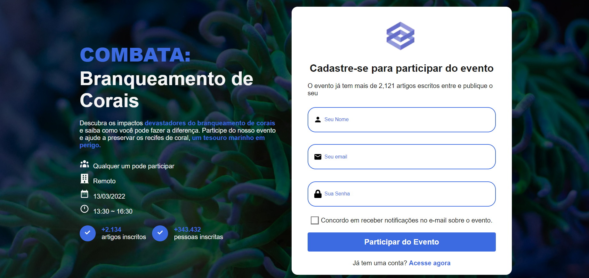
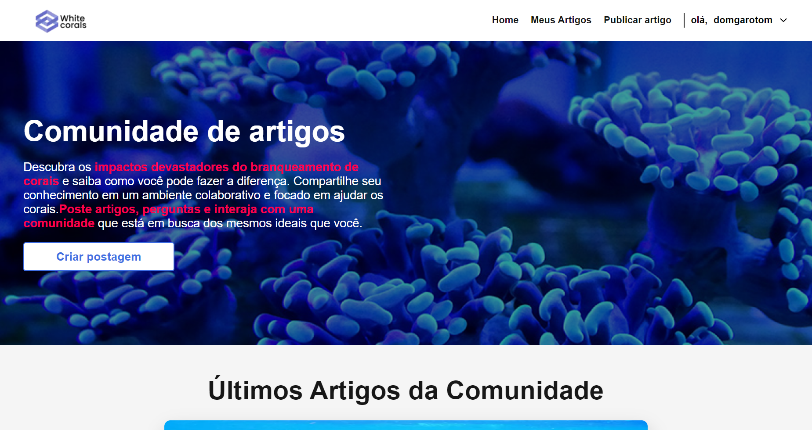
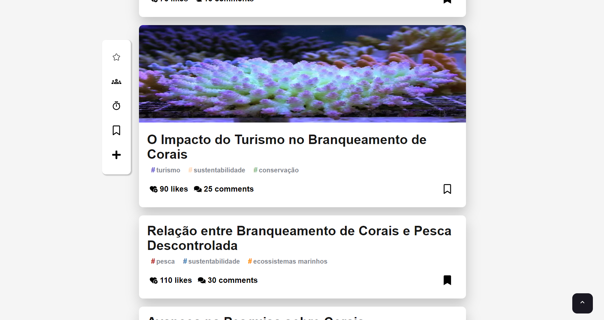
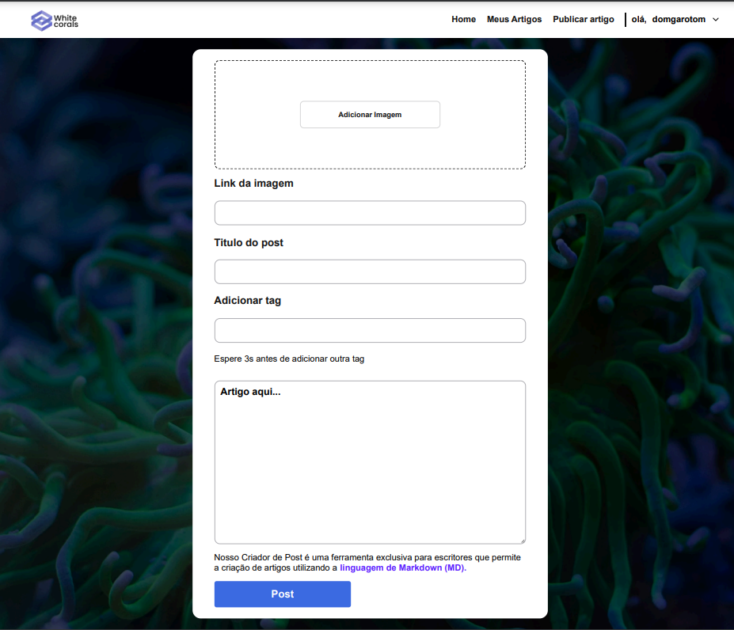
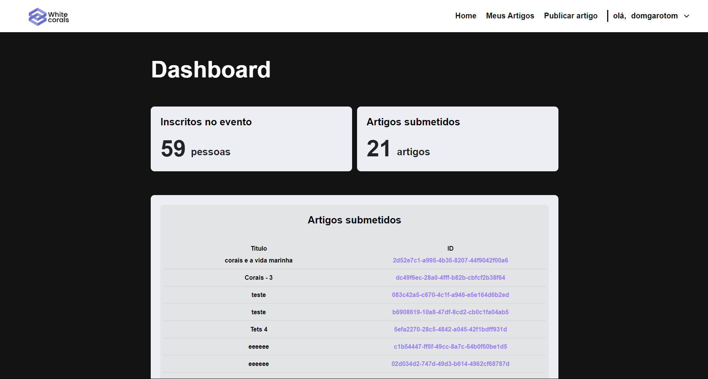

# Sistema de Controle de Inscrições para Evento Científico

Este projeto foi desenvolvido utilizando **Next.js** e tem como objetivo criar um sistema de controle de inscrições para um evento científico sobre o tema "Branqueamento de Corais". O sistema permite que usuários se inscrevam no evento, publiquem artigos científicos e que administradores acompanhem o número de inscrições e artigos submetidos.

## O Projeto

Uma das grandes satisfações deste projeto foi a capacidade de traduzir uma ideia em uma aplicação funcional. A tela de login é o primeiro contato do usuário com o sistema e busca transmitir uma sensação de acolhimento. Aqui está uma visão das principais telas:

### Tela de login

### Tela da Home

### Tela de preview dos artigos

### Tela do Artigo

### Tela de postar Arquivo

### Tela do Dashboard

## Tecnologias Utilizadas

- **Next.js**: Um framework React que permite renderização híbrida e fácil roteamento de páginas.
- **Axios**: Biblioteca usada para consumo de APIs e integração de dados.
- **Styled Components**: Utilizado para a criação de componentes estilizados com CSS-in-JS, garantindo escopo de estilo e facilidade na manutenção de design.
- **Cookies e Local Storage**: Gerenciamento de sessões de usuários e persistência de informações.

## Desafios e Aprendizados

Um dos principais desafios que enfrentei foi a implementação do **Styled Components**. No início, me senti um pouco perdido na forma como os estilos eram aplicados aos componentes, mas, à medida que fui praticando e me familiarizando com a biblioteca, consegui criar um design coeso e visualmente agradável. Aprender a usar Styled Components me permitiu perceber o poder do CSS-in-JS e como ele pode simplificar a manutenção de estilos em projetos maiores.

Além disso, me inspirei em pessoas que admiro para desenhar as telas. Foi gratificante ver como as referências se transformaram em algo concreto, e isso realmente elevou a qualidade do design do projeto. A experiência de criar uma interface que fosse não apenas funcional, mas também esteticamente agradável, foi extremamente recompensadora.

Outro grande aprendizado foi em relação aos **padrões de commit do Git**. Embora no início eu não tivesse um padrão claro, com o tempo aprendi a importância de manter um histórico de commits organizado e informativo. Isso não apenas ajuda na colaboração com outros desenvolvedores, mas também me permitiu entender melhor a evolução do projeto.

## Funcionalidades

1. **Sistema de Inscrições**: Usuários podem se inscrever para o evento através do formulário de cadastro.
2. **Publicação de Artigos**: Após o registro, usuários podem submeter artigos relacionados ao evento.
3. **Painel Administrativo**: Administradores podem visualizar a quantidade de inscritos e de artigos submetidos.

## Autenticação

O sistema conta com autenticação de usuários, permitindo login e acesso a áreas restritas. A autenticação utiliza cookies e armazenamento no Local Storage para persistir as informações da sessão do usuário.
